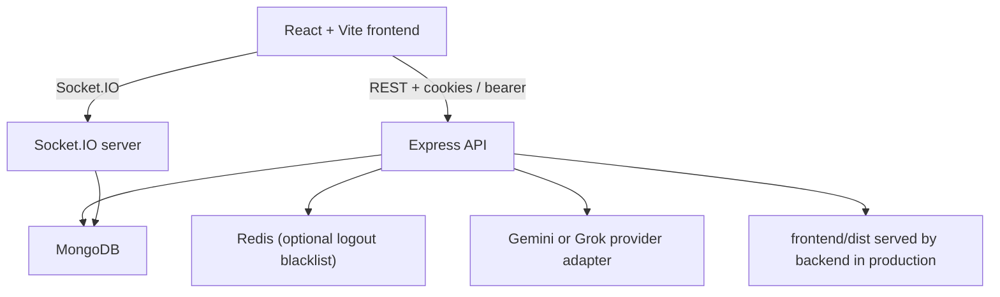

# Torqussions

Torqussions is a full-stack collaborative project workspace that keeps team chat, shared files, live preview, code execution, invitations, and AI-assisted drafting inside one project room.

This repository has been cleaned up for a single-service Railway deployment, upgraded to support both Gemini and Grok, and extended with project-level AI provider/model controls in the UI.

## Highlights

| Area | What’s included |
| --- | --- |
| Collaboration | Project rooms, invitations, member/admin controls, message history |
| Workspace | Shared file tree, Monaco editing, HTML/CSS/JS/Markdown preview, code execution |
| AI | `@ai` trigger, project-scoped provider/model settings, Gemini + Grok support |
| Runtime | Express API, Socket.IO realtime sync, MongoDB persistence, optional Redis token blacklist |
| Deployment | Root-level Railway configuration, same-origin production build and serving |

## Architecture Summary



### Execution flow

1. A user signs in and receives an auth token.
2. The frontend loads project workspace state from `GET /projects/:projectId/workspace`.
3. Project chat and file tree updates flow through Socket.IO when available, with REST fallback if realtime is unavailable.
4. When a message starts with `@ai`, the backend:
   - resolves the project’s configured AI provider and model
   - builds context from recent messages and the current file tree
   - calls Gemini or Grok through a provider adapter
   - stores the AI reply as a project message
   - merges any generated files into the workspace
5. In production, the backend serves the built frontend from `frontend/dist`, so Railway can run this as one service.

## Repository Layout

| Path | Purpose |
| --- | --- |
| `frontend/` | React app, routes, workspace UI, preview, editor, AI settings panel |
| `backend/` | Express API, Socket.IO, services, models, auth, execution, AI integrations |
| `scripts/dev.js` | Root dev launcher for frontend + backend |
| `railway.json` | Railway build/start/healthcheck configuration |

## Tech Stack

### Frontend

- React 19
- Vite
- React Router
- Monaco Editor
- Socket.IO client
- Tailwind CSS

### Backend

- Node.js
- Express 5
- Socket.IO
- MongoDB + Mongoose
- JWT auth
- Redis via `ioredis` for logout token blacklisting

### AI providers

- Gemini via `GEMINI_API_KEY`
- Grok via `XAI_API_KEY`

## Features

### Project rooms

- Create and list projects
- Invite collaborators
- Accept or decline invitations
- Promote admins
- Remove members
- Leave or delete projects

### Shared workspace

- Shared file tree with validation and path sanitization
- Monaco editing for code and text files
- Live preview for HTML, CSS, JavaScript, and Markdown
- In-app execution for Python, JavaScript, C, C++, and Java

### AI workflow

- Send `@ai <request>` in project chat
- AI can answer in chat or generate/update workspace files
- Project admins can switch:
  - provider: Gemini or Grok
  - model: recommended model or custom model id
- Current AI provider/model is visible in the project UI

## Environment Configuration

Copy the example files first:

```bash
cp backend/.env.example backend/.env
cp frontend/.env.example frontend/.env
```

### Backend variables

| Variable | Required | Description |
| --- | --- | --- |
| `PORT` | No | Backend port, default `3000` |
| `NODE_ENV` | No | `development` or `production` |
| `MONGO_URI` | Yes | MongoDB connection string |
| `JWT_SECRET` | Yes | JWT signing secret; use a long random value |
| `CLIENT_URL` | Recommended | Comma-separated allowed frontend origins for CORS |
| `APP_URL` | Optional | Additional allowed production origin |
| `AI_PROVIDER` | No | Default provider if multiple are configured |
| `GEMINI_API_KEY` | Optional | Enables Gemini |
| `GEMINI_MODEL` | No | Default Gemini model |
| `XAI_API_KEY` | Optional | Enables Grok |
| `GROK_MODEL` | No | Default Grok model |
| `REDIS_HOST` | Optional | Redis host for logout token blacklist |
| `REDIS_PORT` | Optional | Redis port |
| `REDIS_PASSWORD` | Optional | Redis password |

### Frontend variables

| Variable | Required | Description |
| --- | --- | --- |
| `VITE_API_URL` | No | Backend origin in split-origin deployments |
| `VITE_SOCKET_URL` | No | Separate Socket.IO origin if needed |
| `VITE_DEV_PROXY_TARGET` | No | Local backend target for Vite proxy, default `http://localhost:3000` |

### Security note

Do not hardcode AI keys into source files. Set them through local env files or Railway variables. This repo is now wired so Grok works through `XAI_API_KEY`; the key should live in environment configuration, not in committed code.

## Local Development

### 1. Install dependencies

```bash
npm install
```

### 2. Configure env files

Set at minimum:

- `backend/.env`
  - `MONGO_URI`
  - `JWT_SECRET`
  - one or both of:
    - `GEMINI_API_KEY`
    - `XAI_API_KEY`

### 3. Run the app

```bash
npm run dev
```

Default local URLs:

- Frontend: `http://localhost:5173`
- Backend: `http://localhost:3000`

## Commands

| Command | What it does |
| --- | --- |
| `npm run dev` | Starts frontend and backend together |
| `npm run build` | Builds the frontend for production |
| `npm run check` | Backend syntax check + frontend production build |
| `npm run lint` | Runs frontend ESLint |
| `npm test` | Runs backend and frontend tests |
| `npm run validate:env` | Validates backend env shape and service connectivity |
| `npm start` | Starts the backend production server |

## AI Model Controls

Each project now has an **AI** panel in the workspace tools section.

Admins can:

- choose Gemini or Grok
- choose a recommended model
- paste a custom model id
- save the setting for the whole project

Members can see the current AI configuration but cannot change it.

## API Surface

### Users

| Method | Route | Purpose |
| --- | --- | --- |
| `POST` | `/users/register` | Create account |
| `POST` | `/users/login` | Login |
| `POST` | `/users/logout` | Logout |
| `GET` | `/users/profile` | Current profile |
| `GET` | `/users/all` | User list for invitations |
| `GET` | `/users/invites` | Pending invitations |
| `POST` | `/users/invites/:inviteId/respond` | Accept or decline invite |

### Projects

| Method | Route | Purpose |
| --- | --- | --- |
| `POST` | `/projects` | Create project |
| `GET` | `/projects` | List current user projects |
| `GET` | `/projects/:projectId` | Load project summary |
| `GET` | `/projects/:projectId/workspace` | Load project, messages, invites, AI settings |
| `POST` | `/projects/:projectId/messages` | Post project message |
| `PUT` | `/projects/:projectId/file-tree` | Save shared file tree |
| `PUT` | `/projects/:projectId/assistant` | Update project AI provider/model |
| `POST` | `/projects/:projectId/execute` | Execute a runnable file |
| `PUT` | `/projects/:projectId/collaborators` | Send invitations |
| `GET` | `/projects/:projectId/invitations` | List pending invites |
| `DELETE` | `/projects/:projectId/invitations/:inviteId` | Cancel invite |
| `PUT` | `/projects/:projectId/admins/:memberId` | Promote admin |
| `DELETE` | `/projects/:projectId/members/:memberId` | Remove member |
| `POST` | `/projects/:projectId/leave` | Leave project |
| `DELETE` | `/projects/:projectId` | Delete project |

## Railway Deployment

This repository is configured for a **single Railway service**:

- Railway installs dependencies at the repo root
- the frontend is built with `npm run build`
- the backend starts with `npm start`
- Express serves the built frontend from `frontend/dist`

### Recommended deployment model

Use one Railway service for the full app.

That gives you:

- one public domain
- same-origin API + Socket.IO traffic
- simpler CORS and cookie behavior
- fewer moving pieces than a split frontend/backend deployment

### Required Railway variables

Set these in Railway:

| Variable | Required |
| --- | --- |
| `NODE_ENV=production` | Yes |
| `PORT` | No |
| `MONGO_URI` | Yes |
| `JWT_SECRET` | Yes |
| `CLIENT_URL` | Yes, set to your Railway public URL or custom domain |
| `GEMINI_API_KEY` or `XAI_API_KEY` | At least one |
| `GEMINI_MODEL` / `GROK_MODEL` | Optional |
| `REDIS_HOST`, `REDIS_PORT`, `REDIS_PASSWORD` | Optional |

### Railway deploy steps

1. Create a new Railway project.
2. Point it at this repository.
3. Add the environment variables above.
4. Deploy the root directory.
5. Confirm `/health` returns `200`.
6. Open the app and verify login, project loading, realtime chat, preview, execution, and AI settings.

If you prefer the CLI:

```bash
railway login
railway init
railway up
```

### Deployment cleanup

This repo is now aligned around Railway as the documented deployment target:

- deployment instructions assume a Railway single-service setup
- application configuration no longer relies on old platform-specific deployment fallbacks
- production serving is handled from the backend via the built frontend bundle

## Validation Workflow

Run the full local validation set:

```bash
npm run lint
npm test
npm run check
```

The backend also exposes:

```bash
npm run validate:env
```

That script checks:

- required env variables
- configured origin formats
- MongoDB connectivity
- optional Redis connectivity

## Testing

The repo now includes lightweight automated tests for:

- AI provider resolution and validation
- workspace file-tree normalization and sanitization
- frontend file normalization and AI model label formatting

Current strategy favors fast unit coverage around core logic and regression-prone helpers. If this project grows further, the next step should be API integration tests around auth, project membership, and AI settings persistence.

## Troubleshooting

### Frontend build works but backend fails at runtime

Check:

- `backend/.env` exists
- `MONGO_URI` is valid
- `JWT_SECRET` is set
- backend dependencies installed correctly

### AI is marked unavailable

Check that at least one provider key is set:

- `GEMINI_API_KEY`
- `XAI_API_KEY`

Then reload the project workspace.

### Socket.IO does not connect in production

Check:

- `CLIENT_URL` matches the public app URL
- the browser is hitting the Railway domain you configured
- reverse proxy / custom domain forwards WebSocket traffic correctly

### `@ai` replies but generated files do not appear

Check:

- the AI response is not blocked by the provider
- the generated file paths are valid relative paths
- the project message metadata includes a `workspaceUpdate`

## Implementation Notes

### Backend improvements

- consolidated project routes and removed duplicated legacy endpoints
- replaced single-provider AI wiring with a provider-aware adapter layer
- added project-level assistant settings persistence
- improved auth middleware error behavior for server-side failures
- cleaned deployment assumptions for Railway

### Frontend improvements

- added project AI settings panel
- surfaced current provider/model in the project UI
- generalized AI message model labeling beyond Gemini-only formatting
- added tests for core workspace and AI labeling helpers

## Follow-up Ideas

- add integration tests for auth + project flows against an in-memory MongoDB instance
- add optimistic UI for assistant settings save
- add usage analytics or rate-limiting around AI-heavy workspaces
- add richer model metadata in the UI, such as reasoning/cost badges
